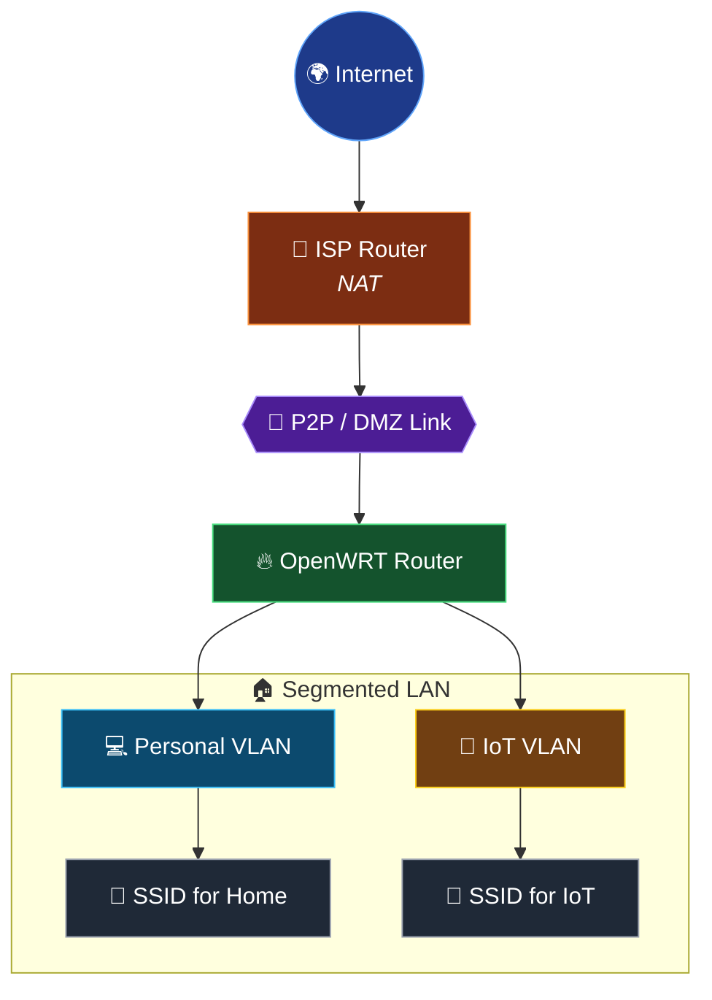

# 🌐 Network

Overview of the network design of the homelab.

## 📑 Index

- [Design philosophy](#-design-philosophy)
- [Topology](#-topology)
- [Edge & NAT](#-edge--nat)
- [Segmentation](#-segmentation)
- [WiFi](#-wifi)
- [Firewall](#-firewall)
- [DHCP & DNS](#-dhcp--dns)

---

## 🧠 Design philosophy

The network is built around a few simple principles:

- **Segmentation by trust level**, not by convenience.
- **One router to rule them all**: a single OpenWRT device handles
  routing, firewalling, DHCP, and VLANs.
- **Delegate NAT to the edge**, keeping the internal router focused
  on segmentation and policy.
- **Treat WiFi and wired the same way**: same segments, same rules.
- **Default deny** between segments, with granular exceptions.

---

## 🗺️ Topology

---

## 🔗 Edge & NAT

- **NAT is delegated to the ISP router**, which sits at the edge.
- The OpenWRT router is connected through a **dedicated point-to-point
  link** that acts as a **DMZ / transit segment**.
- This keeps the internal router focused on segmentation, firewalling
  and DHCP — not on managing the public boundary.
- The OpenWRT router **routes everything** from the LAN out through
  this transit link.

---

## 🧩 Segmentation

Two internal segments, separated by trust level:

| Segment       | Purpose                                | DHCP     |
|---------------|----------------------------------------|----------|
| Personal VLAN | Trusted devices (laptops, phones, etc.)| OpenWRT  |
| IoT VLAN      | Untrusted / smart devices              | OpenWRT  |

Both segments are served by the **same router** (OpenWRT), but they
are isolated by firewall policy.

---

## 📶 WiFi

- Each segment has its **own SSID**.
- WiFi traffic is tagged into the corresponding VLAN (802.1Q).
- Wired and wireless devices share the same policies per segment —
  the transport doesn't change the trust level.

---

## 🛡️ Firewall

Granular, **per-VLAN** firewall rules on the OpenWRT router:

**Golden rules applied:**

1. No segment trusts another by default.
2. The untrusted segment **never initiates** connections to the trusted one.
3. Traffic is evaluated by **interface + direction + service**.
4. **Default deny**, with the minimum necessary opened.

---

## 📡 DHCP & DNS

- **DHCP:** served by the **OpenWRT router** on each VLAN.
- **DNS:** handled internally by Pi-hole (see [server docs](./server.md)),
  with the OpenWRT router as the entry point.

---

## 📝 Notes

This document focuses on **design decisions and reasoning**, not on
exact configuration. IP ranges, VLAN IDs, SSIDs, and specific firewall
rules are intentionally omitted.
