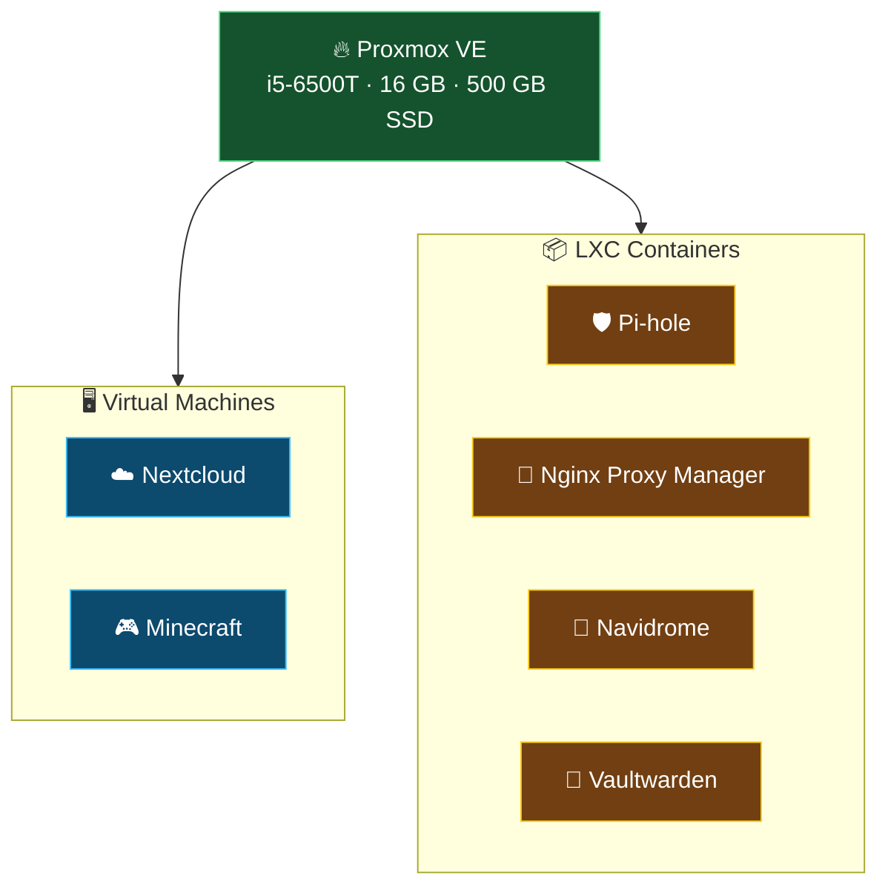
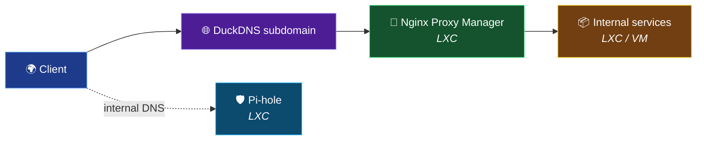

# 🖥️ Server

Main server of the homelab, running **Proxmox VE** as the virtualization layer.

## 📑 Index

- [Design philosophy](#-design-philosophy)
- [Hardware](#-hardware)
- [Virtualization layer](#-virtualization-layer)
- [Workload strategy](#-workload-strategy)
- [Services](#-services)
- [Storage](#-storage)
- [Access & networking](#-access--networking)
- [Backups](#-backups)
- [Roadmap](#-roadmap)

---

## 🧠 Design philosophy

The whole setup is built around **doing more with limited resources**.

- **Prefer LXC over VMs** whenever possible: containers are lighter,
  share the kernel, and save RAM on a machine with only 16 GB.
- **Use VMs only when necessary** (e.g. full OS isolation, kernel-level
  requirements, or workloads that just don't fit an LXC).
- **Centralize HTTP(S) entry** through a single reverse proxy, so each
  service stays simple and focused.
- **Keep the attack surface small**: internal DNS, internal reverse
  proxy, no direct exposure of individual services.
- **Treat the server as a trusted node** inside the trusted network
  segment, not exposed to the outside by itself.

---

## 🏗️ Hardware

| Component   | Detail                          |
|-------------|---------------------------------|
| CPU         | Intel Core i5-6500T (4c / 4t)   |
| RAM         | 16 GB                           |
| Storage     | 500 GB SATA SSD                 |
| Form factor | Mini PC / SFF                   |
| Role        | Primary hypervisor              |

Small, silent, low-power — sized for a home lab, not a datacenter.

---

## 🧱 Virtualization layer

- **Hypervisor:** Proxmox VE 9.x
- **Node type:** Standalone (no cluster)
- **Storage backend:** LVM-thin on a single SSD
- **Workload types:** QEMU VMs + LXC containers

---

## 📦 Workload strategy

| Workload          | Type | Why                                              |
|-------------------|------|--------------------------------------------------|
| Nextcloud         | VM   | Heavier stack, needs full OS isolation           |
| Minecraft         | VM   | Java workload, isolated from the rest            |
| Pi-hole           | LXC  | Tiny footprint, perfect fit for a container      |
| Nginx Proxy Mgr.  | LXC  | Lightweight, always-on, minimal resources        |
| Navidrome         | LXC  | Small service, no kernel-level requirements      |
| Vaultwarden       | LXC  | Lightweight, ideal for a dedicated container     |

**Rule of thumb:**

> If it can run in an LXC and doesn't need kernel-level features,
> it runs in an LXC. VMs are reserved for workloads that genuinely
> need full isolation or their own kernel.

On a 16 GB box, this matters: LXC overhead is a fraction of a full VM.

---

## 🧩 Services

| Service              | Purpose                    | Type | Notes                        |
|----------------------|----------------------------|------|------------------------------|
| Pi-hole              | Internal DNS / ad-blocking | LXC  | DNS for the internal network |
| Nginx Proxy Manager  | Reverse proxy + HTTPS      | LXC  | Front door for HTTP(S)       |
| Navidrome            | Music streaming            | LXC  | Personal media               |
| Vaultwarden          | Password manager           | LXC  | Self-hosted secrets          |
| Nextcloud            | Personal cloud             | VM   | Files, sync, calendar        |
| Minecraft            | Game server                | VM   | On-demand, not always running|

---

## 💾 Storage

- **Single SSD**, no NAS, no ZFS pool, no external array.
- Layout: default Proxmox install with **LVM-thin** on top.
- Sensible for a mini PC: simple, fast, low maintenance.

**Off-site strategy:**

- No local replication, no dedicated backup server.
- Data considered worth keeping long-term is pushed to **third-party
  cloud storage in encrypted form**.
- Encryption is done client-side, so the provider never sees plaintext.

---

## 🌐 Access & networking

- The server lives in the **trusted network segment**, alongside
  personal devices — not in the IoT segment.
- No direct public exposure of individual services.
- All HTTP(S) traffic is funneled through **Nginx Proxy Manager**,
  which handles TLS termination.
- Public entry uses a **DuckDNS subdomain** for dynamic DNS resolution.
- Internal DNS resolution is handled by **Pi-hole**.

---

## 💾 Backups

**Status: pending.**

- No Proxmox Backup Server, no scheduled `vzdump` jobs yet.
- Long-term plan is to add a proper backup strategy:
  - local `vzdump` jobs for VM/LXC snapshots,
  - off-site encrypted copies for critical data.

This is a known gap — documented here on purpose.

---

## 🚧 Roadmap

- [ ] Set up scheduled backups (`vzdump` and/or PBS)
- [ ] Define a proper 3-2-1 backup strategy
- [ ] Add monitoring / alerting for the hypervisor and key services
- [ ] Review service exposure and harden the reverse proxy
- [ ] Consider a secondary disk or external storage for redundancy

---

## 📝 Notes

This document focuses on **design decisions and reasoning**, not on
exact configuration. IPs, hostnames, and specific rules are intentionally
omitted.
